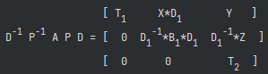
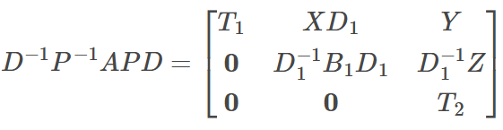

# $ \LaTeX $ in Flag4j Javadoc

---

## 1. What!? $ \LaTeX $ in Javadoc? 

That's right! Your eyes do not deceive!
Flag4j supports using $ \LaTeX $ in the web-based Javadoc API. How is this achieved you may ask?
By injecting the MathJax script into all HTML files generated by the Javadoc doclet. Then 
a script is run to replace HTML based equations with $ \LaTeX $ equations to be rendered by MathJax. 
The Javadoc comments must be formatted correctly for this to work.

## 2. Doc Comment Syntax
There are four ways to specify that an HTML equation/symbol should be replaced with a 
$ \LaTeX $ equation/symbol. [Simple inline replacements](#21-simple-inline--latex--replacements),
[simple display-mode replacements](#22-simple-display--latex--replacements), 
[aligned replacements](#23-aligned--latex--replacements), 
and [custom replacements](#24-customized--latex--replacements).

### 2.1 Simple Inline $ \LaTeX $ Replacements
For simple inline html-to-$ \LaTeX $ replacements, the content to be replaced may
be placed within a `<span class="latex-inline">...</span>` block. This will replace
the content in the block with `\( .... \)` and convert any sub/superscripts, common mathematical
symbols, and greek letters from html form to $ \LaTeX $. For a full list of all replacements made for
simple latex replacements, see [A1](#a1-simple--latex--regex-replacements).

`<pre>...</pre>` will be discarded when making the conversion.
Simple fractions of the form `(...) / (...) ` are also supported. 
The parentheses are required for proper conversion.

The following docstring,
```java
/**
 * The equation <span class="latex-inline">y = &amp;alpha;x + b</span> 
 * will be solved for <span class="latex-inline">x</span>.
 * 
 * <span class="latex-inline">(3x<sup>2</sup>) / (&amp;radic;(2y - 1))</span>
 */
```

will be converted to the following in the final HTML,
```html
The equation \( y = \alpha x + b \)
will be solved for \( x \).

\( \cfrac{3x^{2}}{\sqrt{2y - 1}} \)
```
---

### 2.2 Simple Display $ \LaTeX $ Replacements

To render $ \LaTeX $ in display mode, use the tags 
`<span class="latex-display">...</span>`

The same rules apply as in the inline rendering.

The following docstring,
```java
/**
 * The equation <span class="latex-display">y = &amp;alpha;x + b</span> 
 * will be solved for <span class="latex-inline">x</span>.
 * 
 * <span class="latex-display">(3x<sup>2</sup>) / (&amp;radic;(2y - 1))</span>
 */
```

will be converted to the following in the final HTML,
```html
The equation \[ y = \alpha x + b \]
will be solved for \( x \).

\[ \cfrac{3x^{2}}{\sqrt{2y - 1}} \]
```

---

### 2.3 Aligned $ \LaTeX $ Replacements

If you would like to align a multi-line HTML equation by equal or "implies" signs, use
the tags `<span class="latex-eq-aligned">...</span>`. There must be exactly one '='
per line of the equation. Similarly, `<span class="latex-impl-aligned">...</span>` can
be used for implication chains.

The following docstring,
```java
/**
 * <span class="latex-eq-aligned">
 * <pre>
 *     A = T B T<sup>-1</sup>
 *       = P D B D<sup>-1</sup> P<sup>-1</sup></pre>
 * </span>
 *
 * <span class="latex-impl-aligned">
 * <pre>
 *      x < &alpha; &amp;Implies; x < &amp;Sigma;<sub>i=1</sub><sup>N</sup> (y<sub>i</sub>);
 *            &amp;Implies; x < &amp;beta;</pre>
 * </span>
 */
```

will be converted to the following in the final HTML,
```html
 \[ \begin{align*} A &amp;= T B T^{-1} \\
&amp;= P D B D^{-1} P^{-1}. \end{align*} \]

\[ \begin{align*} x < \alpha  &amp;\implies x < \sum_{i=1}^{N} \left (y_{i}\right ) \\
&amp;\implies x < \beta  \end{align*} \]
```

---

### 2.4 Customized $ \LaTeX $ Replacements
For more complicated $ \LaTeX $ Replacements we may want to specify <em>exactly</em> what
the $ \LaTeX $ should be replacing the HTML. To do this we utilize the `<span
class="latex-replaceable">...</span>` block.

To specify custom $ \LaTeX $ you must provide an HTML equation for simple rendering within an IDE. 
This allows users to avoid seeing raw $ \LaTeX $ in the docs rendered by the IDE. 

You can then optionally provide a $ \LaTeX $ equation within an HTML comment to replace the preceding HTML equation.

#### 2.1.1 Specifying An HTML Equation Is "$ \LaTeX $ Replaceable"
The following doc comment specifies that an equation is replaceable 
```java
/**
 * <span class="latex-replaceable">
 * <pre>
 *               <sup>    </sup>[ T<sub>1</sub>     X*D<sub>1</sub>       Y   ]
 *   D<sup>-1</sup> P<sup>-1</sup> A P D = [  0  D<sub>1</sub><sup>-1</sup>*B<sub>1</sub>*D<sub>1</sub>  D<sub>1</sub><sup>-1</sup>*Z  ]
 *               <sup>    </sup>[  0      0         T<sub>2</sub>  ]</pre>
 * </span>
 */
```
The `<span class="latex-replaceable">` tag indicates that the following HTML equation may be replaced by
a $ \LaTeX $ equation when building the docs. This tag and the closing `</span>` <em>must</em>
be included for the equation to be replaced. If there is not a latex equations following this, the
tag will be ignored.

Providing the equation as HTML allows The  InteliJ IDE to render the equations as:



This looks okay, but we know that $ \LaTeX $ could look <em>SO</em> much better!

#### 2.1.2 Specifying A Custom $ \LaTeX $ Equation
We do not want the $ \LaTeX $ equation to rendered in an IDE as raw text. To avoid this, we place
the equation inside a special HTML comment. The comment must begin with `<!-- LATEX:`.
```java
/**
 * <!-- LATEX:
 * $$ \begin{bmatrix}
 * T_1 & XD_1 & Y \\
 * \mathbf{0} & D_1^{-1}B_1D_1 & D_1^{-1}Z \\
 * \mathbf{0} & \mathbf{0} & T_2
 * \end{bmatrix}  $$
 * -->
 */
```

The HTML comment `<!-- LATEX: ... -->` must immediately follow the `<span 
class="latex-replaceable">...</span>`
block for it to be utilized (white space and newlines are allowed between the two). 
Otherwise, the $ \LaTeX $ comment will be ignored.

The single '\$' character is not supported for inline $ \LaTeX $ (i.e. `$ ... $`) in default MathJax. 
Instead, use `\( ... \)` for inline equations. Both ``$$ ... $$`` and `\[ ... \]` may be used for display mode.

#### 2.1.3 Full Example
The full doc comment would look something like,
```java
/**
 * Some stuff...
 *
 * <span class="latex-replaceable">
 * <pre>
 *               <sup>    </sup>[ T<sub>1</sub>     X*D<sub>1</sub>       Y   ]
 *   D<sup>-1</sup> P<sup>-1</sup> A P D = [  0  D<sub>1</sub><sup>-1</sup>*B<sub>1</sub>*D<sub>1</sub>  D<sub>1</sub><sup>-1</sup>*Z  ]
 *               <sup>    </sup>[  0      0         T<sub>2</sub>  ]</pre>
 * </span>
 *
 *
 * <!-- LATEX:
 * $$ \begin{bmatrix}
 * T_1 & XD_1 & Y \\
 * \mathbf{0} & D_1^{-1}B_1D_1 & D_1^{-1}Z \\
 * \mathbf{0} & \mathbf{0} & T_2
 * \end{bmatrix}  $$
 * -->
 *
 * Some more stuff...
 */
```

The exact regex used in python to match such instances is:
```regexp
(<span class="latex-replaceable">.*?</span>)\s*<!-- LATEX:\s*(\{@literal\s*.*?\s*}\s*) -->
```
where `.*` will match <em>any</em> character including newlines. If the text in the generated 
HTML does not match this, no replacements will be made.

In an IDE, the $ \LaTeX $ in the comment will <em>not</em> be rendered. The user will <em>only</em> see the
HTML equation. Once the Javadocs are built, parsed, and deployed to the [Flag4j API website](https://jacobdwatters.github.io/Flag4j/),
the HTML equation will be fully replaced with the $ \LaTeX $ equation and MathJax will render it as:



Wow! That looks so much better! Enjoy your $ \LaTeX $.

# Appendix
## A.1 Simple $ \LaTeX $ Regex Replacements
This is the full regex replacement mapping for simple latex tags: `<span class=simple-inline>`,
`<span class=simple-display>`, `<span class=latex-eq-aligned>`, `<span class=latex-impl-aligned>`.

Replacements are performed in the same order they appear in the mapping.

```python
html2latex = {
    # Braces
    r"\{": r"\\left {", r"\}": r"\\right }",

    # Simple fractions
    r"\([ ]*([^()<>]+)[ ]*\)[ ]*/[ ]*\([ ]*([^()<>]+)[ ]*\)": r"\\cfrac{\g<1>}{\g<2>}",

    # Parens, brackets
    r"\(": r"\\left (", r"\)": r"\\right )", r"\[": r"\\left [", r"]": r"\\right ]",

    # Sums and products
    r"&amp;Sigma;<sub>(.*?)</sub><sup>(.*?)</sup>": r"\\sum_{\g<1>}^{\g<2>}",
    r"&amp;Pi;<sub>(.*?)</sub><sup>(.*?)</sup>": r"\\prod_{\g<1>}^{\g<2>}",

    # Lowercase greek
    r"&amp;alpha;": r"\\alpha ", r"&amp;beta;": r"\\beta ", r"&amp;gamma;": r"\\gamma ", r"&amp;delta;": r"\\delta ", r"&amp;epsilon;": r"\\epsilon ",
    r"&amp;zeta;": r"\\zeta ", r"&amp;eta;": r"\\eta ", r"&amp;theta;": r"\\theta ", r"&amp;iota;": r"\\iota ", r"&amp;kappa;": r"\\kappa ",
    r"&amp;lambda;": r"\\lambda ", r"&amp;mu;": r"\\mu ", r"&amp;nu;": r"\\nu ", r"&amp;xi;": r"\\xi ", r"&amp;omicron;": r"\\omicron ", r"&amp;pi;": r"\\pi ",
    r"&amp;rho;": r"\\rho ", r"&amp;sigma;": r"\\sigma ", r"&amp;tau;": r"\\tau ", r"&amp;upsilon;": r"\\upsilon ", r"&amp;phi;": r"\\phi ",
    r"&amp;chi;": r"\\chi ", r"&amp;psi;": r"\\psi ", r"&amp;omega;": r"\\omega ",

    # Uppercase greek
    r"&amp;Alpha;": r"\\Alpha ", r"&amp;Beta;": r"\\Beta ", r"&amp;Gamma;": r"\\Gamma ", r"&amp;Delta;": r"\\Delta ", r"&amp;Epsilon;": r"\\Epsilon ",
    r"&amp;Zeta;": r"\\Zeta ", r"&amp;Eta;": r"\\Eta ", r"&amp;Theta;": r"\\Theta ", r"&amp;Iota;": r"\\Iota ", r"&amp;Kappa;": r"\\Kappa ",
    r"&amp;Lambda;": r"\\Lambda ", r"&amp;Mu;": r"\\Mu ", r"&amp;Nu;": r"\\Nu ", r"&amp;Xi;": r"\\Xi ", r"&amp;Omicron;": r"\\Omicron ", r"&amp;Pi;": r"\\Pi ",
    r"&amp;Rho;": r"\\Rho ", r"&amp;Sigma;": r"\\Sigma ", r"&amp;Tau;": r"\\Tau ", r"&amp;Upsilon;": r"\\Upsilon ", r"&amp;Phi;": r"\\Phi ",
    r"&amp;Chi;": r"\\Chi ", r"&amp;Psi;": r"\\Psi ", r"&amp;Omega;": r"\\Omega ",

    # Sub/superscripts
    r"<sub>": r"_{", "</sub>": "}", r"<sup>": r"^{", "</sup>": r"}",

    # Boldface
    r"<b>(.*?)</b>": r"\\mathbf{\g<1>}", r"<strong>(.*?)</strong>": r"\\mathbf{\g<1>}",

    # Common sets.
    r"ℝ": r"\\mathbb{R}", r"ℚ": r"\\mathbb{Q}", r"ℂ": r"\\mathbb{C}", r"ℤ": r"\\mathbb{Z}", r"ℕ": r"\\mathbb{N}",

    # Operators
    r"&amp;lt;": r"<", r"&amp;gt;": r">", r"&amp;le;": r"\\leq ", r"&amp;ge;": r"\\geq ", r"&amp;ne;": r"\\neq ", r"&amp;plusmn;": r"\\pm ",
    r"&amp;isin;": r"\\in ", r"&amp;notin;": r"\\notin ", r"&amp;radic;\((.*)?\)": r"\\sqrt{\g<1>}", r"&asymp;": r"\\approx ",
    r"&amp;oplus;": r"\\oplus ", r"&amp;Implies;": r"\\implies", r"&amp;times;": r"\\times", r"&amp;middot;": r"\\cdot",

    # Other symbols.
    r"&amp;infin;": r"\\inf ", r"\.\.\.": r"\\cdots ", r"&amp;ell;": r"\\ell "
}
```
